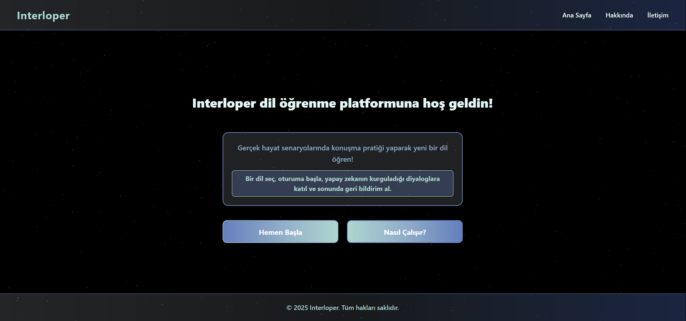

# Interloper

Interloper, gerçek hayat senaryolarında konuşma pratiği yaparak dil öğrenmeyi kolaylaştıran bir platformdur. Yapay zeka destekli diyaloglar sayesinde, seçtiğiniz senaryoda kendinizi gerçek bir ortamda hissedebilir ve konuşma becerilerinizi geliştirebilirsiniz.

## Özellikler

- Gerçek hayat senaryoları ile konuşma pratiği
- Yapay zeka ile hayatın içinden diyaloglar
- Oturum sonunda performans değerlendirmesi ve geri bildirim
- Farklı diller ve senaryolar seçebilme
- Modern ve kullanıcı dostu arayüz

## Nasıl Çalışır?

1. **Dili seç:** Öğrenmek istediğiniz dili seçin.
2. **Senaryoyu seç:** Gerçek hayattan bir senaryo seçin.
3. **Senaryoda konuşma gerçekleştir:** Yapay zekayla senaryoya uygun bir diyalog kurun.
4. **Sonuçlarını gör:** Konuşmanın sonunda performansınızı ve geri bildirimi inceleyin.

## Kurulum

```bash
git clone https://github.com/denizhoroz/interloper
cd interloper/client
npm install
npm start build
npm start
cd interloper/server
npm install
npm start
cd interloper/
```

Arka uç servisleri için `server` klasörünü ve Python servislerini başlatmayı unutmayın.

## Katkıda Bulunanlar

- [Emre Atasavun](https://www.linkedin.com/in/emre-atasavun-125918303/) - [GitHub](https://github.com/Fridgemann)
- [Deniz Eren Horoz](https://www.linkedin.com/in/denizhoroz/) - [GitHub](https://github.com/denizhoroz)

## Lisans

MIT License

---

Daha fazla bilgi için [Hakkında](./client/app/(main)/about/About.js) ve [Nasıl Çalışır](./client/app/(main)/how-it-works/HowItWorks.js) sayfalarını ziyaret edebilirsiniz.