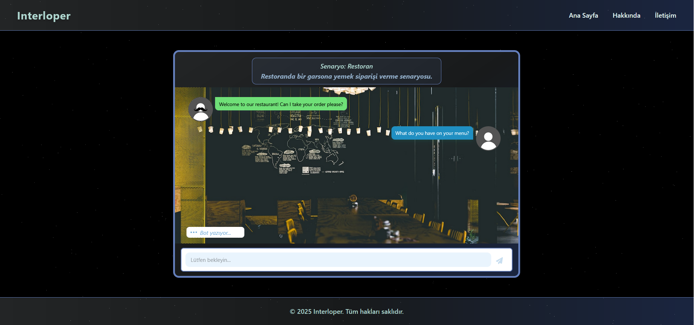

# Interloper

Interloper, gerçek hayat senaryolarında konuşma pratiği yaparak dil öğrenmeyi kolaylaştıran bir platformdur. Yapay zeka destekli diyaloglar sayesinde, seçtiğiniz senaryoda kendinizi gerçek bir ortamda hissedebilir ve konuşma becerilerinizi geliştirebilirsiniz.

## Özellikler

- Gerçek hayat senaryoları ile konuşma pratiği
- Yapay zeka ile hayatın içinden diyaloglar
- Oturum sonunda performans değerlendirmesi ve geri bildirim
- Farklı diller ve senaryolar seçebilme
- Modern ve kullanıcı dostu arayüz

## Nasıl Çalışır?

1. **Dili seç:** Öğrenmek istediğiniz dili seçin.
2. **Senaryoyu seç:** Gerçek hayattan bir senaryo seçin.
3. **Senaryoda konuşma gerçekleştir:** Yapay zekayla senaryoya uygun bir diyalog kurun.
4. **Sonuçlarını gör:** Konuşmanın sonunda performansınızı ve geri bildirimi inceleyin.



## Gereksinimler
- llama-3-8b-instruct (quantized Q4_K_M) modeli
- Node.js >= 18
- npm >= 9
- Python == 3.10.11
- Gerekli Python paketleri (requirements.txt dosyasına bakınız)
- Modern bir web tarayıcısı (Chrome, Firefox, Edge, Safari)

## Kurulum

Proje üç servis üzerinden çalışmaktadır. Bu yüzden toplam 3 terminal açmanız gerekmektedir. İlk başta herhangi bir terminal üzerinden repoyu klonlayın.

```ps
git clone https://github.com/denizhoroz/interloper
```

İlk başta aşağıdaki drive linkini kullanarak LLM modelini .rar olarak indirebilirsiniz. (Github'ın boyut sınırlamalarından ötürü modeli Github üzerinden yükleyemiyoruz.) 

<a href="https://drive.google.com/drive/folders/1-bkOGLRl5KOBetnYmxI3bM9_6DYHd2RG?usp=sharing">Model linki</a>

Modeli indirdikten ve unzipledikten (Buraya ayıkla) sonra models/ klasörünü interloper/ klasörünün içine atın.

Birinci terminal üzerinde `server` servisini başlatın.

```ps
# Birinci terminal
cd interloper/server
npm install
npm start
```

İkinci terminal üzerinde `client` servisini başlatın.

```ps
# İkinci terminal
cd interloper/client
npm install
npm run build
npm start
```

Üçüncü terminal üzerinde `Python` sanal ortamı kurun ve aktif edin.

```ps
# Üçüncü terminal
py -3.10 -m venv venv
venv/Scripts/activate
```

Gerekli Python paketlerini `requirements.txt` ile indirin.

```ps
# Üçüncü terminal
pip install -r requirements.txt
```

`Python` servisini başlatın

```ps
cd/server
python py_service.py
```

Daha sonra bu adres üzerinden websitesine local olarak ulaşabilirsiniz.

http://localhost:3000

## Gereksinimler ve Ortam Değişkenleri

Projeyi yerel olarak çalıştırmak için aşağıdaki ortam değişkenlerini ayarlamanız gerekmektedir:

### Sunucu için `.env` dosyası (`server/.env`):

```
PORT=5000
CLIENT_URL=http://localhost:3000
PYTHON_SERVICE_URL=http://localhost:8000
DEEPL_API_KEY=<YOUR_API_KEY_HERE>
```

### İstemci için `.env.local` dosyası (`client/.env.local`):

```
NEXT_PUBLIC_API_URL=http://localhost:5000
```

> Şu anda proje sadece yerel geliştirme için uygundur. Sunucu ve istemciyi kendi bilgisayarınızda başlatmanız gerekmektedir. Barındırma (hosting) desteği yoktur.

## Katkıda Bulunanlar

- [Emre Atasavun](https://www.linkedin.com/in/emre-atasavun-125918303/) - [GitHub](https://github.com/Fridgemann)
- [Deniz Eren Horoz](https://www.linkedin.com/in/denizhoroz/) - [GitHub](https://github.com/denizhoroz)

## Lisans

MIT License

---

Daha fazla bilgi için [Hakkında](./client/app/(main)/about/About.js) ve [Nasıl Çalışır](./client/app/(main)/how-it-works/HowItWorks.js) sayfalarını ziyaret edebilirsiniz.